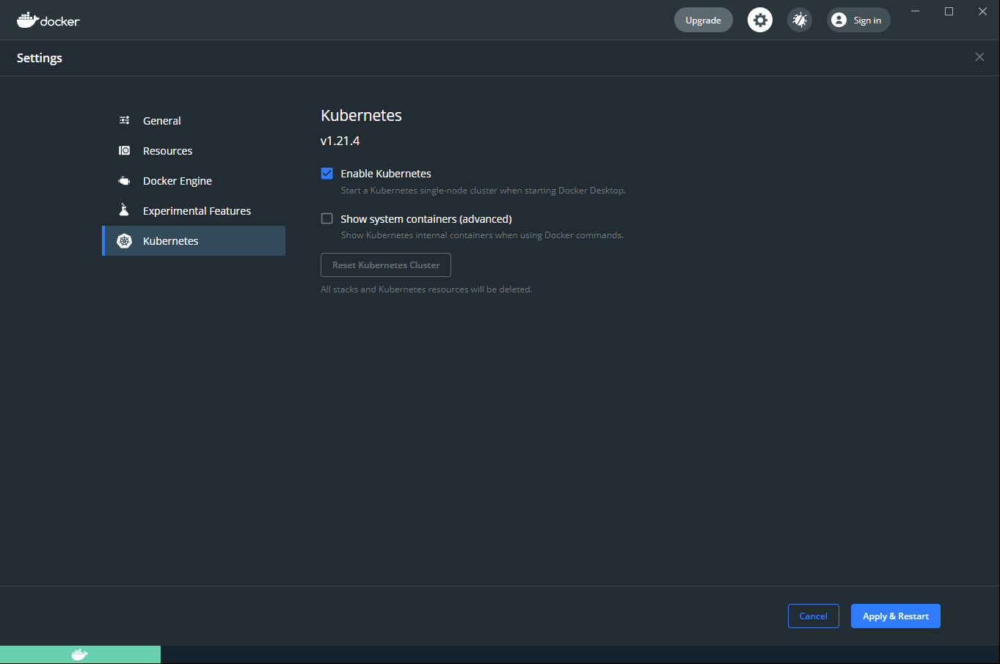

# mjr-kubernetes

## Prerequisites

### Install Docker Desktop and create a Kubernetes cluster

1. Download and Install [Docker Desktop](https://www.docker.com/products/docker-desktop).

2. Open Docker Desktop and go to **Preferences** > **Kubernetes** en click '**Enable Kubernetes**'.



3. Verify that Docker and kubectl are correctly installed using the following commands:

```
docker
```

```
kubectl
```

### Preload Docker images

The internet connection at the hotel might not be great, so it's best to pull the images we're going to use at home.

1. Pull the ASP.NET 5 Runtime
   
```
docker pull mcr.microsoft.com/dotnet/aspnet:5.0
```

2. Pull the .NET 5 SDK

```
docker pull mcr.microsoft.com/dotnet/sdk:5.0
```

3. Pull Node

```
docker pull node:16.8.0-alpine3.13
```